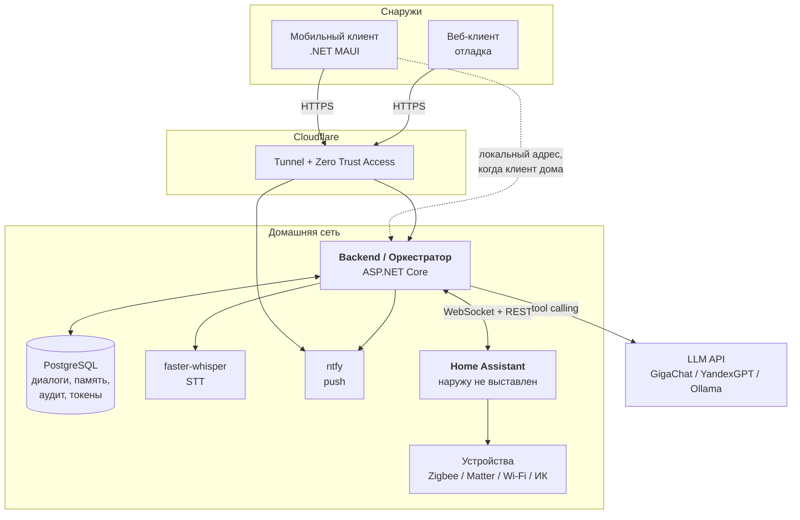

# Домовой

[](https://github.com/k-kuzmin/domovoy/actions/workflows/gitleaks.yml)
[](https://github.com/k-kuzmin/domovoy/actions/workflows/build.yml)
[](LICENSE)

Персональный AI-агент для умного дома. Управление устройствами и ответы на
вопросы о состоянии дома на естественном языке, через Home Assistant, с
проактивными уведомлениями и собственным набором инструментов.

Отличие от штатных голосовых помощников — полный контроль над системным
промптом, набором инструментов и памятью; данные о доме не уходят третьим
лицам сверх необходимого.

> [!IMPORTANT]
> **В репозитории нет и не должно быть реальных данных.** Ни секретов, ни
> реальных `entity_id`, ни имён хостов, IP, MAC-адресов, ни топика ntfy, ни
> состава жильцов. Все примеры — вымышленная квартира и плейсхолдеры.
> Подробнее: [Секреты и приватные данные](#секреты-и-приватные-данные).

## Статус

**Этап 0 из 6 — каркас.** Структура решения, интерфейсы, DI-регистрация,
работающий `/health`. Бизнес-логики нет: реализации портов — заглушки.

Дорожная карта — в [milestones](https://github.com/k-kuzmin/domovoy/milestones),
разбивка работ — в [issues](https://github.com/k-kuzmin/domovoy/issues).

## Архитектура

Home Assistant не имеет публичного входа. Любой доступ снаружи — только через
Backend, по TLS, через Cloudflare Tunnel: исходящее соединение к edge, входящих
соединений к домашней сети нет, порты на роутере не открываются.



**Разделение ответственности**

| Слой | Отвечает за | Не отвечает за |
|---|---|---|
| Home Assistant | драйверы протоколов, состояния сущностей, детерминированные автоматизации | понимание естественного языка, память диалога |
| Backend | LLM-оркестрация, tool calling, память, профиль дома, проактивные правила, аутентификация | прямое общение с железом |
| Мобильный клиент | UI, запись аудио, приём push, отображение состояния | бизнес-логика, секреты, прямой доступ к HA |

Критичные для безопасности автоматизации — протечка перекрывает воду,
задымление включает сирену — живут на стороне Home Assistant, а не в правилах
Backend: они обязаны срабатывать при остановленном Backend и без интернета.

## Структура решения

```
src/
  Domovoy.Api            HTTP-слой, SSE, аутентификация устройств
  Domovoy.Core           оркестратор, tool-цикл, роутер, шаблоны ответов, порты
  Domovoy.Ha             клиент Home Assistant (REST + WebSocket), реестр сущностей
  Domovoy.Llm            адаптеры провайдеров (GigaChat, YandexGPT, Ollama)
  Domovoy.Voice          STT/TTS
  Domovoy.Notifications  правила проактивности, ntfy
  Domovoy.Data           EF Core, миграции
tests/
  Domovoy.Tests          модульные, архитектурные и smoke-тесты
```

Чистая архитектура, зависимости направлены внутрь. `Domovoy.Core` содержит
только порты и модели и **не ссылается ни на один другой проект решения** —
ни на транспорт, ни на БД, ни на провайдеров. Направление зависимостей
проверяется архитектурным тестом, а не соглашением.

## Стек

| Компонент | Решение |
|---|---|
| Backend | ASP.NET Core 8 (LTS), minimal API |
| Хранилище | PostgreSQL 16 + EF Core |
| LLM основной | GigaChat через OpenAI-совместимый слой |
| LLM резервный | YandexGPT |
| LLM перспектива | локальная модель через Ollama |
| STT | faster-whisper (ru) на сервере |
| TTS | Piper (ru), опционально |
| Push | ntfy, self-hosted |
| Мобильный клиент | .NET MAUI (Android приоритет) |
| Публикация наружу | Cloudflare Tunnel |
| Развёртывание | Docker Compose |

Провайдер LLM задаётся конфигурацией — `base_url`, `api_key`, `model`,
`dialect`. Провайдер-специфичных ветвлений вне слоя адаптера нет.

## Быстрый старт

Нужен только Docker. Запуск на примерах конфигурации, без реальных ключей:
незаполненный секрет — это состояние «не сконфигурировано», а не отказ старта.

```bash
git clone https://github.com/k-kuzmin/domovoy.git
cd domovoy

cp .env.example .env
cp config/entities.example.yaml       config/entities.yaml
cp config/home-profile.example.md     config/home-profile.md
cp config/proactive-rules.example.yaml config/proactive-rules.yaml
cp config/response-templates.example.yaml config/response-templates.yaml

docker compose up -d --build
curl -s http://localhost:8080/health
```

Ожидаемый ответ — `{"status":"degraded"}`: без токена Home Assistant и ключа
провайдера LLM состояние деградированное, но сервис поднят. Анонимный
`/health` отдаёт только это одно поле; раздельный статус БД, Home Assistant и
LLM доступен на `GET /api/v1/health` под токеном устройства.

Скопированные `config/*.yaml` и `.env` закрыты `.gitignore` — заполнять их
реальными значениями безопасно. Пароль базы в `.env.example` — значение для
примера: наружу порт базы не публикуется, но при реальной эксплуатации
`POSTGRES_PASSWORD` меняется.

## Локальная разработка

Проекты собираются под `net8.0`. SDK 9 подходит: целевой пакет `net8.0`
подтягивается из NuGet, нужен установленный рантайм 8.0.

```bash
# Git-хуки: без этой команды pre-commit не работает —
# файлы в .githooks не подключаются к клону сами
git config core.hooksPath .githooks

dotnet restore
dotnet build
dotnet test
dotnet run --project src/Domovoy.Api
```

Секреты локально — только через `dotnet user-secrets`, они лежат в профиле
пользователя вне дерева проекта:

```bash
cd src/Domovoy.Api
dotnet user-secrets set "Ha:Token"        "<токен Home Assistant>"
dotnet user-secrets set "Llm:ApiKey"      "<ключ провайдера>"
dotnet user-secrets set "Ntfy:Topic"      "<имя топика>"
dotnet user-secrets list
```

### Команды

| Задача | Команда |
|---|---|
| Сборка | `dotnet build` |
| Тесты | `dotnet test` |
| Запуск API | `dotnet run --project src/Domovoy.Api` |
| Формат и стиль | `dotnet format --verify-no-changes` |
| Миграции: создать | `dotnet ef migrations add <Имя> --project src/Domovoy.Data --startup-project src/Domovoy.Api` |
| Миграции: применить | `dotnet ef database update --project src/Domovoy.Data --startup-project src/Domovoy.Api` |
| Поиск секретов: индекс | `gitleaks git --staged --redact --no-banner` |
| Поиск секретов: история | `gitleaks git --redact --no-banner` |
| Стек целиком | `docker compose up -d --build` |

## API

Базовый префикс `/api/v1`, аутентификация — Bearer-токен устройства.
На этапе каркаса все эндпоинты, кроме `/health`, отвечают `501`.

| Метод | Путь | Назначение |
|---|---|---|
| `POST` | `/auth/device` | регистрация устройства, обмен кода привязки на токен |
| `POST` | `/chat` | текстовый запрос, ответ потоком SSE |
| `POST` | `/voice` | multipart с аудио, первое событие потока — `recognized` |
| `POST` | `/confirm` | подтверждение чувствительного действия |
| `GET` | `/state` | срез состояния дома для экрана «Дом» |
| `POST` | `/action` | быстрое действие из UI, минуя LLM |
| `GET` | `/notifications` | лента уведомлений |
| `GET` | `/health` | раздельный статус БД, Home Assistant и LLM |

Формат ошибок единый: `{ "error": { "code": "...", "message": "...", "details": ... } }`.

`GET /health` без префикса и без токена отдаёт только пригодность к работе —
для healthcheck контейнера и туннеля. Подробный статус компонентов доступен
на `GET /api/v1/health` под Bearer-токеном: публичный домен индексируется и
сканируется, состав компонентов наружу не отдаётся.

## Секреты и приватные данные

Секретов и приватных данных нет в файлах проекта **ни в одной копии** — ни в
публичной, ни в локальной. Веток «чистая» и «рабочая» не существует. Значения
приходят из источников конфигурации .NET, код читает `IConfiguration` и не
знает происхождения значения.

| Среда | Источник |
|---|---|
| Локальная разработка | `dotnet user-secrets` |
| Продакшен | переменные окружения через `env_file` в Docker Compose |

**Приватное — не только ключи.** Реестр сущностей и профиль дома вместе дают
планировку, состав жильцов, расписание отсутствия и расположение датчиков.
Это чувствительнее токенов. Не попадают в репозиторий:

- реальные `entity_id`, особенно содержащие имена людей
- профиль дома: комнаты, жильцы, распорядок
- имена хостов и поддоменов, локальные IP, MAC-адреса
- **имя топика ntfy** — функционально это пароль: знающий его читает
  уведомления и отправляет свои
- правила проактивности с реальными привязками
- дампы БД, бэкапы Home Assistant, логи

**Два рубежа защиты.** Основной — `gitleaks` в pre-commit хуке: блокирует
коммит до попадания данных в историю. Дублирующий — `gitleaks` в CI на каждый
push и PR, на случай коммита в обход хуков. Помимо стандартных правил
провайдеров закрыты токен Home Assistant, ключи GigaChat и Yandex Cloud,
топик ntfy, приватные IPv4, MAC-адреса и реальные имена хостов. В настройках
репозитория включены secret scanning и push protection.

Репозиторий публичный с первого коммита. Схема «сначала приватно, потом
почистить и открыть» не применяется: перезапись истории не удаляет данные из
форков, кэша хостинга и чужих клонов. Секрет, однажды попавший в коммит,
считается скомпрометированным и подлежит **отзыву**, а не удалению.

## Дорожная карта

| Этап | Содержание | Готово, когда |
|---|---|---|
| 0 | Инфраструктура, репозиторий, каркас, Docker Compose | `/health` отвечает, стек поднимается на примерах, машина переживает перезагрузку |
| 1 | Ядро без LLM: WebSocket к HA, allow-list, быстрый роутер | текстовые команды по шаблонам управляют устройствами |
| 2 | LLM-оркестрация: адаптер, инструменты, tool-цикл, SSE, учёт токенов | свободные формулировки приводят к действиям, 70 % запросов в один раунд |
| 3 | Проактивность, push, публикация наружу | открытая дверь при уходе даёт уведомление на телефон |
| 4 | Голос: faster-whisper, `/voice` | голосовая команда отрабатывает в целевые сроки |
| 5 | Мобильное приложение MAUI, Android APK | приложение заменяет отладку через curl |
| 6 | Долговременная память, профиль дома, подтверждения, локальная LLM | — |

Приложение делается пятым, а не первым: промпт и набор инструментов будут
переписываться ежедневно первые недели — на сервере это `git push`, в
приложении пересборка и переустановка.

## Решения

Решения, расходящиеся с ТЗ или не выводимые из него, записаны в
[`docs/decisions/`](docs/decisions/README.md). Причина простая: через
месяц по коду не отличить принятое решение от недосмотра.

Наиболее заметные: в репозитории только плейсхолдеры вместо реальных
хостов, `/health` разделён на анонимный и защищённый, валидация
конфигурации на старте проверяет форму, а не наличие секретов.

## Лицензия

[MIT](LICENSE)
