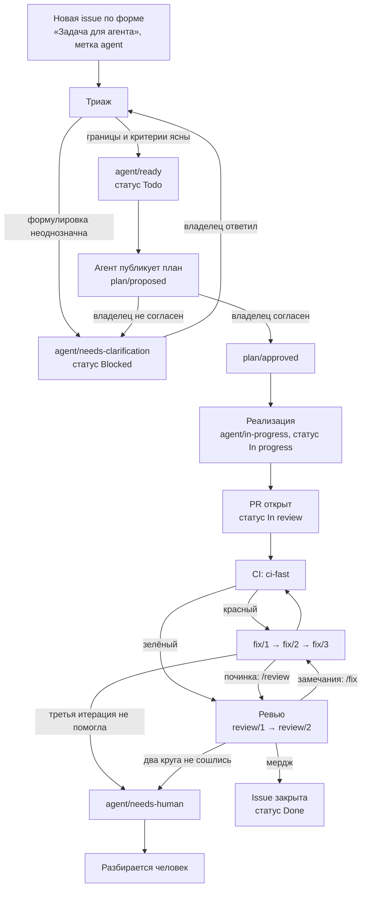

# Агентский цикл

Как задача проходит путь от issue до мерджа, что в этом пути делает агент, а
что остаётся за человеком, и какие настройки репозитория нужно выставить
руками, чтобы всё это работало.

Документ описывает обвязку, а не самих агентов: workflow-файлы `agent-*.yml`
и `scripts/guard.sh` живут отдельно и здесь только упоминаются.

## Основной режим: задачу ведёт человек из Claude CLI

**Пять `agent-*.yml` выключены и по умолчанию не запускаются.** Задачу ведёт
человек: открывает `claude` в терминале, называет номер issue и доводит работу
до PR. GitHub при этом остаётся тем, чем был, — местом, где лежат задачи и где
на PR отрабатывают гейты.

Разница между режимами только в том, кто нажимает на старт. Ни одно
ограничение не живёт внутри `agent-*.yml`, поэтому все они работают одинаково
в обоих режимах:

| Слой | Где работает | Нужны секреты |
|---|---|---|
| Правила `.claude/CLAUDE.md` | CLI читает сам | нет |
| Определения `.claude/agents/step-*.md` | только локальный режим | нет |
| Хуки `commit-msg`, `pre-commit`, gitleaks | локально до коммита | нет |
| `scripts/guard.sh` — гейт целостности | локально и в `CI (fast)` | нет |
| `CI (fast)` и `CI (heavy)` | на любом push и PR | нет |
| CODEOWNERS, branch protection, метки | GitHub | нет |
| Пять `agent-*.yml` | только они | да |

Выключены они переменной, а не отсутствием секретов: у каждой job стоит
`if: vars.AGENT_LOOP_ENABLED == 'true'`. Отсутствие `ANTHROPIC_API_KEY` запуск
не остановило бы — процесс стартовал бы и упал на шаге вызова модели, засоряя
историю красными прогонами. Включение цикла — `vars.AGENT_LOOP_ENABLED = true`
плюс два секрета из таблицы ниже.

Разделы ниже описывают цикл в его включённом виде. **Локально те же шаги
разыгрываются не в одном разговоре:** задачу ведёт оркестратор — основная
сессия, — а каждый шаг выполняет субагент с чистым контекстом, своей моделью,
своим набором инструментов и своим файлом правил из `docs/rules/`.
Определения лежат в `.claude/agents/step-<шаг>.md`. Точки вмешательства
человека те же: апрув плана и мердж.

Механизм проверен живым прогоном, а не чтением кода: определение становится
вызываемым типом шага, `model` из frontmatter применяется (триаж пошёл на
младшей модели, а шаг без этого поля — на модели сессии), а `hooks.PreToolUse`
отбивает команду вне списка шага и доносит причину до субагента текстом, не
роняя шаг. Значит, запрет `dotnet ef` на шаге реализации локально механический,
а не добросовестный. Что наблюдалось, командами и результатом, —
`docs/tasks/77.md`.

Так локальный режим получает главное свойство цикла — шаг не видит контекста
предыдущего шага, — не заводя пяти процессов и не выключая ничего из того, что
перечислено в таблице выше. Что оркестратор передаёт субагенту и что тот читает
сам — `.claude/CLAUDE.md`, раздел «Локальный режим: оркестратор и шаги»;
обоснование и отвергнутые варианты — запись
[0018](decisions/0018-local-orchestrator-and-step-subagents.md).

Разница между режимами остаётся одна и та же: кто нажимает на старт. В цикле
шаги запускает GitHub Actions по событиям, локально — оркестратор.

## Цикл



Ключевое свойство: **разрешающие шаги делает только человек.** Агент вешает
`agent/needs-clarification`, `agent/in-progress`, `plan/proposed`, `fix/N`,
`review/N` —
то есть сообщает о своём состоянии. `agent/ready`, `plan/approved`,
`agent/allow-protected` и `agent/allow-contract` ставит владелец: это
разрешения, а не отчёты.

## Прерывание и продолжение

Работа прерывается всегда: кончается сессия, падает терминал, кончается день.
Схема рассчитана на это — **всё состояние задачи живёт вне сессии**, и новая
начинается не с нуля.

Где что лежит:

| Что | Где | Переживает обрыв |
|---|---|---|
| Стадия, следующий шаг, решения, вопросы | `docs/tasks/<номер>.md` в ветке | да |
| Разрешения и отчёты о состоянии | метки на issue | да |
| План | комментарий в issue | да |
| Код | коммиты в запушенной ветке | да |
| Связь ветки с задачей | черновой PR со ссылкой `Closes #N` | да |
| Счётчик попыток починки | метки `fix/1..3` на PR | да |
| Счётчик кругов ревью | метки `review/1..2` на PR | да |
| Ход рассуждений | контекст сессии | **нет** |
| Незакоммиченные правки | рабочий каталог | **нет** — файлы на диске остаются, но новая сессия про них не знает |

Последняя строка — единственное по-настоящему опасное место. Окно между
«начал писать код» и «запушил ветку» ничем не защищено: обрыв в нём стоит
потерянной работы, а не паузы. Отсюда правило из `.claude/CLAUDE.md`: **ветка
пушится сразу** после первого зелёного локального прогона и дальше часто, даже
если работа не закончена.

Черновой PR — про другое и открывается позже, когда основная реализация
завершена и тесты зелёные (запись
[0015](decisions/0015-draft-pr-when-implementation-ready.md)). От обрыва он не
защищает: связь ветки с задачей нужна тому, кто продолжит работу, а не тому,
кто её потерял.

### Как продолжить

1. `docs/tasks/<номер>.md` — строка `Следующий шаг` в шапке. Она отвечает на
   вопрос «с чего начать» одной фразой; всё остальное в журнале — контекст к
   ней. Раздел «Вопросы и ответы» читается до того, как задавать вопрос
   владельцу: половина уже задана.
2. Метки на issue — на какой стадии остановились и чего ждут: `agent/ready`,
   `plan/proposed`, `plan/approved`, `agent/needs-human`.
3. `gh pr view <номер> --comments` — план, замечания ревью, номер попытки
   починки по меткам `fix/N`.
4. `gh pr checks <номер>` — что именно красное. Продолжать починку, не
   посмотрев логи предыдущей попытки, — верный способ повторить её.

Отдельно про режим работы из CLI: у `claude` есть `--continue` и `--resume`,
восстанавливающие стенограмму разговора. Это спасение от закрытого терминала,
но не замена журналу — стенограмма лежит локальным файлом на конкретной
машине и вторым участником работы не читается.

## Метки

Заводятся один раз командой `scripts/bootstrap.sh`. Скрипт идемпотентен,
повторный запуск безопасен и приводит цвета и описания к тому, что записано
в самом скрипте, — он и есть источник истины по агентским меткам. Метки
`stage/*`, `area/*`, `type/*`, `priority/*` он не трогает.

| Метка | Ставит | Что означает |
|---|---|---|
| `agent` | автор issue (по форме) | Задача в принципе пригодна для агента |
| `agent/ready` | владелец | Разрешение начать |
| `agent/needs-clarification` | агент | Формулировка неоднозначна, нужен ответ |
| `agent/in-progress` | агент | Работа идёт прямо сейчас |
| `agent/needs-human` | агент | Остановился, дальше без человека нельзя |
| `agent/flaky` | агент или владелец | Проверка плавает, результату CI веры нет |
| `agent/allow-protected` | владелец | Разрешает править защищённые пути |
| `agent/allow-contract` | владелец | Разрешает менять контракт API |
| `plan/proposed` | агент | План опубликован, ждёт разбора |
| `plan/approved` | владелец | План одобрен, можно писать код |
| `fix/1`, `fix/2`, `fix/3` | агент | Номер итерации исправлений |
| `review/1`, `review/2` | агент | Номер круга ревью |

Три итерации `fix` — потолок. После `fix/3` агент обязан поставить
`agent/needs-human` и остановиться: четвёртая попытка вслепую обходится
дороже, чем пятнадцать минут человека.

Два круга `review` — второй потолок, и считается он отдельно: падение CI и
замечание ревьюера — разные поводы, и общий счётчик их смешивал. Третий круг
того же ревьюера по тому же коду почти всегда означает не найденный дефект, а
несогласие о подходе, а его решает человек. Обоснование и то, почему цикл
замыкается комментарием `/review`, а не событием `synchronize`, — запись
[0016](decisions/0016-review-rounds-capped-at-two.md).

Считаются **все** круги, включая первый и запущенные вручную. Практическое
следствие: комментарий `/review` — рычаг человека, и он тоже расходует круги.
После второго ревью третий `/review` вернёт не ревью, а `agent/needs-human`.
Снять метки `review/1` и `review/2` — способ начать счёт заново, и это
осознанное действие человека, а не обход.

Оба плеча цикла замкнуты комментариями, и оба — рычаги человека:

| Команда | Что запускает | Кто обычно пишет |
|---|---|---|
| `/review` | Ревью PR, следующий круг | `agent-fix` после починки по замечаниям |
| `/fix` | Починку по замечаниям ревью | `agent-review` при вердикте `changes_requested` |

Формального отзыва `changes_requested` в этой цепочке нет, и не по забывчивости:
запросить изменения в собственном PR GitHub не даёт, а автор PR здесь всегда
владелец — ветку пушит `agent-implement` его же токеном. Проверено вызовом API,
обоснование — запись
[0017](decisions/0017-fix-triggered-by-comment.md). Путь через отзыв у
`agent-fix` остался и работает, но только когда «запросить изменения» ставит
человек.

## Статусы на доске

Карточку двигает `.github/workflows/status-sync.yml`, а не агент. Имена
статусов перечислены в `env` этого workflow одним блоком:

| Событие | Статус |
|---|---|
| `agent/ready` на issue | `Todo` |
| `agent/in-progress` на issue | `In progress` |
| `agent/needs-human` или `agent/needs-clarification` | `Blocked` |
| PR открыт или выведен из черновика | `In review` |
| PR переведён в черновик | `In progress` |
| PR смержен | `Done` |
| PR закрыт без мерджа | `In progress` |
| Issue закрыта | `Done` |
| Issue закрыта как «not planned» | `Cancelled`, необязательный |
| Issue переоткрыта | `Todo` |

`Cancelled` — единственный необязательный статус в таблице: если его на доске
нет, отменённая задача просто останется в прежней колонке, а в логе появится
предупреждение. Остальные пять нужны.

Посмотреть, что заведено на доске сейчас. Этот же запрос — первая проверка
нового `PROJECTS_TOKEN`: он не должен возвращать `null`.

```bash
GH_TOKEN='ваш PAT' gh api graphql -f owner='k-kuzmin' -F number=2 -f query='
  query($owner: String!, $number: Int!) {
    repositoryOwner(login: $owner) {
      ... on ProjectV2Owner {
        projectV2(number: $number) {
          id
          title
          field(name: "Status") {
            ... on ProjectV2SingleSelectField { options { name } }
          }
        }
      }
    }
  }'
```

Статус вычисляется по **всему текущему набору меток** issue, а не по той
одной, что пришла в событии: иначе снятие `agent/in-progress` навсегда
оставило бы карточку в «In progress».

Если статуса с таким именем на доске нет, `scripts/set-project-status.sh`
пишет предупреждение и перечисляет те, что заведены, — workflow при этом не
падает. Приведите набор статусов на доске к таблице выше или поправьте имена
в `env` workflow: одно из двух, но именно вручную.

### Почему PR требует английского ключевого слова

Карточка на доске заведена на issue, а у события `pull_request` нет
`github.event.issue.node_id`: PR и issue — разные объекты. Workflow
спрашивает у GitHub, какие задачи закрывает этот PR, и двигает их карточки.

Связь возникает только от английских ключевых слов в теле PR: `closes #12`,
`fixes #12`, `resolves #12`. Шаблон PR в этом репозитории пишет
«Закрывает #12», и связью GitHub это **не считает**. Поэтому в workflow есть
запасной путь: номер issue берётся из имени ветки `feat/<номер>-описание`,
которого требует `.claude/CLAUDE.md`. Если не сработало ни то ни другое,
workflow пишет `::warning::` с номером PR и именем ветки — карточку тогда
двигают руками:

```bash
export GH_TOKEN='ваш классический PAT со scope project'
PROJECT_OWNER='k-kuzmin' \
PROJECT_NUMBER='2' \
ISSUE_NODE_ID="$(gh api repos/k-kuzmin/domovoy/issues/12 --jq .node_id)" \
STATUS='In review' \
  scripts/set-project-status.sh
```

Тот же скрипт вызывается вручную через `workflow_dispatch` у `status-sync`:
номер issue и имя статуса — входные параметры.

## Как апрувить план

Агент публикует план комментарием к issue и ставит `plan/proposed`. План
годен к одобрению, если из него видно:

- какие файлы будут созданы и изменены — списком путей, а не «слой Ha»;
- как будет проверен каждый критерий приёмки из issue;
- что из смежного намеренно не делается;
- нужны ли новые зависимости (по `.claude/CLAUDE.md` — только с обоснованием
  до установки) и записи в `docs/decisions/`.

Одобрение: снять `plan/proposed`, поставить `plan/approved`. Комментарий с
формулировкой «одобряю» не заменяет метку — код запускает метка.

```bash
gh issue edit 12 --remove-label plan/proposed --add-label plan/approved
```

Если план неверен, метка `plan/approved` не ставится: пишется комментарий с
тем, что не так, и вешается `agent/needs-clarification`. Правка чужого плана
в комментарии по частям — худший вариант: агент реализует смесь двух планов.

## Что делать при `agent/needs-human`

Метка означает, что агент остановился сам. Порядок разбора:

1. **Прочитать последний комментарий агента.** Он обязан назвать, что именно
   не получилось, и что уже пробовалось.
2. **Определить причину.** Практически всегда одна из четырёх:
   - критерий приёмки невыполним в заданных границах — расширить границы
     отдельным решением или переформулировать критерий;
   - нужны разрешения: правка защищённых путей или контракта API — поставить
     `agent/allow-protected` или `agent/allow-contract`, если согласны;
   - требование ТЗ противоречиво — завести «Открытый вопрос» по форме
     `decision.yml` и связать с задачей; агентская задача ждёт;
   - тест плавает — пометить `agent/flaky` и чинить тест отдельной задачей,
     а не подгонять код под него.
3. **Ответить в issue и снять метку.** Снятие `agent/needs-human` вместе с
   `agent/ready` — сигнал продолжать. Пока метка висит, агент задачу не
   берёт, и карточка стоит в `Blocked`.
4. **Если разбор занял больше получаса** — вопрос был не к агенту, а к
   формулировке задачи. Стоит поправить `agent-task.yml`, чтобы следующая
   задача такой не была.

Ровно та же метка ставится и владельцем: это способ отобрать задачу у агента,
не закрывая её.

## Как временно отключить агентов

По убыванию надёжности:

1. **Отключить workflow целиком** — работает без правки файлов, мгновенно и
   переживает перезапуски:

   ```bash
   gh workflow list --all
   gh workflow disable agent-triage.yml
   gh workflow disable agent-implement.yml
   gh workflow enable agent-triage.yml     # обратно
   ```

   Это основной выключатель. Он не зависит от содержимого `agent-*.yml`, а
   значит, не сломается от их правок.

2. **Убрать ключ модели** — останавливает всё, что ходит в API, независимо от
   того, какие workflow включены:

   ```bash
   gh secret delete ANTHROPIC_API_KEY
   ```

   Самый жёсткий вариант: агентские запуски начнут падать на отсутствии
   секрета. Годится как аварийный, не как повседневный.

3. **Снять метку с задачи** — точечный рычаг, останавливает одну задачу:

   ```bash
   gh issue edit 12 --remove-label agent/ready --add-label agent/needs-human
   ```

4. **Переменная-выключатель `vars.AGENT_LOOP_ENABLED`** — штатное состояние
   цикла. Она проверяется на уровне job в каждом из пяти файлов, поэтому
   запуск не начинается вовсе:

   ```bash
   gh variable set    AGENT_LOOP_ENABLED --body true    # включить
   gh variable delete AGENT_LOOP_ENABLED                # выключить
   ```

   **По умолчанию переменной нет — цикл выключен.** В отличие от пункта 1,
   это зависимость от содержимого `agent-*.yml`: правка, снявшая условие,
   снимет и выключатель. Как аварийный рычаг надёжнее пункт 1, как штатный
   режим — этот.

Отключение workflow не трогает `status-sync.yml`: доска продолжит
обновляться по действиям человека, и это правильно.

## Настройки репозитория, которые выставляются руками

Ни одна из них не задаётся файлом в репозитории — только через веб-интерфейс
или API.

### Branch protection на `main`

Сейчас защиты нет: API отвечает `404 Branch not protected`, прямой push
разрешён, и за всю историю в репозитории **не открыто ни одного PR** —
20 коммитов легли прямо в `main`. Первым делом стоит проверить порядок
«ветка → PR → мердж» на живом примере, и только потом включать защиту:
иначе первая же ошибка в настройке заблокирует единственного разработчика.

Что включить:

- **Require a pull request before merging.**
- **Require approvals: 0.** Не единица. GitHub не засчитывает апрув автора
  PR, а разработчик здесь один — требование одного апрува заблокировало бы
  каждый его PR навсегда. Защита при нуле апрувов сохраняется: PR всё равно
  обязателен и всё равно ждёт зелёного CI.
- **Require status checks to pass** — список ниже.
- **Require branches to be up to date before merging.**
- **Block force pushes** и **restrict deletions**.
- Прямые коммиты в `main` для документации, разрешённые `.claude/CLAUDE.md`,
  после включения защиты станут невозможны. Либо принять это и вести
  документацию через PR, либо оставить себе обход через ruleset с bypass для
  владельца — но осознанно, а не по недосмотру.

### Required status checks

Required status check сверяется с **отображаемым именем** работы — значением
`name:`, а не идентификатором. В этом репозитории работы названы по-русски,
поэтому в защиту вписываются именно эти строки:

| Обязательная проверка | Откуда |
|---|---|
| `Сборка, стиль, тесты` | `ci-fast.yml` |
| `Гейт целостности` | `ci-fast.yml` |
| `Проверки обвязки` | `ci-fast.yml` |
| `Уязвимые пакеты` | `ci-fast.yml` |
| `Поиск секретов в истории` | `gitleaks.yml` |
| `Сообщения коммитов` | `gitleaks.yml` |
| `Тяжёлые проверки пройдены` | `ci-heavy.yml` |

Работы `Стек поднимается на примерах конфигурации` и `Статический анализ
CodeQL` в список **не** вносятся напрямую: они условные и на черновике
пропускаются, а пропущенная required-проверка держит PR незакрытым навсегда.
Их итог сводит работа `Тяжёлые проверки пройдены` — она запускается всегда и
краснеет, если любая из них упала.

`Гейт целостности` запускается только на событии `pull_request`. Это не
мешает: защита проверяет чеки как раз на PR.

`Проверки обвязки` — работа про сам инструментарий, и потому её имя шире
прежнего «Правила шагов и промпты». Сверки и харнессы к ним:

| Что сверяется | Чем | Сценарии на саму сверку |
|---|---|---|
| Правила шагов ↔ промпты и указатель | `scripts/rules-sync.sh` | `scripts/rules-sync.test.sh` |
| Скрипты ↔ вызовы из workflow | `scripts/wiring.sh` | `scripts/wiring.test.sh` |
| Поведение гейта целостности | — | `scripts/guard.test.sh` |
| Поведение инварианта числа тестов | — | `scripts/test-count-invariant.test.sh` |

Харнесс гейта живёт здесь, а не в работе `Гейт целостности`: гейту условие
`pull_request` необходимо — на push нет базовой ветки для сравнения, — а
харнесс диффа не смотрит и на push в `main` идти обязан. По той же причине
здесь и харнесс инварианта: сам инвариант считает результат прогона и потому
идёт шагом в `Сборка, стиль, тесты`, а его сценарии обходятся рукописными
trx-отчётами и dotnet им не нужен.

**Перечень — про дифф, инвариант — про результат.** `SUPPRESSION_PATTERNS` в
`scripts/guard.sh` ловит известные приёмы: атрибут `Ignore` над тестом, `Skip`
с текстом причины, `continue-on-error` у шага работы. Это быстрая обратная
связь — приём назван по имени, показана строка. Обходится он
изобретательностью: снятый `Assert`, опустевший набор `[InlineData]`, тест,
унесённый в непрогоняемый проект. Рядом поэтому стоит
`scripts/test-count-invariant.sh` — сумма атрибута `executed` по trx-отчётам
против снимка `tests/test-count.baseline`. Незнакомый приём он ловит потому,
что не ищет признаков вовсе. Не любой: то, чего не ловит и он, перечислено в
его же шапке — снятый `Assert`, перенос теста между проектами при том же числе
и приложенный к PR лишний trx-отчёт, добивающий сумму до снимка.

Приёмы здесь названы, а не выписаны шаблонами, и это не небрежность. Проверка 2
ищет свои шаблоны в диффе любого файла, кроме защищённых путей, а
`docs/pipeline.md` к защищённым не относится: строка документации, цитирующая
шаблон дословно, роняет гейт на самой себе — и метка `agent/allow-protected`
этого не снимает, она про проверку 1. Точные шаблоны живут в одном месте — в
`SUPPRESSION_PATTERNS`.

Сравнение точное: красный и на убыль, и на рост. Каждый PR с новым тестом
один раз краснеет и правит одну строку снимка — цена принята сознательно,
потому что устаревшая вниз база разрешала бы удалить ровно столько тестов,
сколько добавили после её последней правки.

**Метки-обхода у инварианта нет** — ни у него, ни у проверки 7 гейта, которая
ловит понижение самого снимка. Законное уменьшение числа тестов — удаление
функциональности вместе с её тестами — перестаёт быть операцией обычного PR:
его проводит человек вручную, прямым коммитом в `main` либо временным снятием
обязательной проверки. Новой метки в таблице выше поэтому не появилось.

Сверка обвязки закрывает этаж выше: она следит, чтобы каждый скрипт из
`scripts/` вызывался хотя бы одним workflow, а каждый вызов вёл в
существующий файл. Убранный шаг иначе не виден никак — скрипт остаётся в
репозитории и выглядит работающим. Скрипт, которому в CI делать нечего,
объявляет это маркером `# БЕЗ ОБВЯЗКИ:` с причиной в своей шапке; сейчас
такой один — `scripts/bootstrap.sh`.

Чего сверка обвязки не ловит — своего собственного шага: удалили его, и
никто не запустится. Не ловит она и прямой push в `main` мимо PR: работа на
этом событии идёт, но коммит к тому моменту уже в ветке. Оба случая
закрывает не скрипт, а ревью человека и защита ветки — та самая, которой
сейчас нет.

> Имена стоит сверить с живым PR перед вводом: опечатка в required-проверке
> даёт не ошибку, а вечно ожидающий чек, которого никто не выставит.

### Остальное

- **Merge queue** — не включать. Очередь решает конфликт параллельных
  мерджей, которого при одном разработчике не бывает, а задержку добавляет
  каждому PR. Вернуться к вопросу, если агентов станет несколько и они начнут
  открывать PR одновременно.
- **Allow auto-merge** — включить. Это то, ради чего затевалась защита:
  агент открывает PR и ставит `gh pr merge --auto --squash`, PR вливается сам,
  когда чеки позеленели. Без auto-merge человек нужен на каждом мердже.
- **Allow squash merging**, остальные способы выключить; **Automatically
  delete head branches** — включить.
- **Settings → Actions → General → Workflow permissions**: нужен флаг
  «Allow GitHub Actions to create and approve pull requests», иначе агент не
  сможет открыть PR. Апрувить PR агенту всё равно нельзя — это правило
  процесса, а не настройки.
- **Environment `release`** с продакшен-секретами и обязательным ревьюером
  (владельцем). Смысл в том, чтобы агентские workflow физически не доставали
  боевые значения: секреты уровня репозитория видны любому workflow, секреты
  окружения — только работе, которая это окружение объявила и дождалась
  подтверждения.

### Про CODEOWNERS

Файл `.github/CODEOWNERS` в репозитории есть, и он полезен: GitHub
автоматически запрашивает ревью владельца по затронутым путям.

Галочку **«Require review from Code Owners» в настройках включать не надо.**
Причина та же, что и с числом апрувов: GitHub не засчитывает апрув автора PR,
а единственный code owner здесь — сам автор. Включённое требование
заблокировало бы каждый его PR без возможности выполнить условие. Галочка
выглядит логичным продолжением файла CODEOWNERS — она им не является.

### Секреты и переменные

| Имя | Где | Зачем | Есть? |
|---|---|---|---|
| `ANTHROPIC_API_KEY` | secret | Работа агентов | Нет |
| `AGENT_TOKEN` | secret | Сцепка шагов цикла — см. ниже | Нет |
| `PROJECTS_TOKEN` | secret | Запись в Projects v2 | Нет |
| `PROJECT_NUMBER` | variable | Номер доски (`2`) | Нет |
| `AGENT_LOOP_ENABLED` | variable | Выключатель цикла; без неё `agent-*.yml` не стартуют | Нет — цикл выключен |

### `AGENT_TOKEN` — чем и почему он отличается от штатного токена

Три шага цикла работают не штатным `GITHUB_TOKEN`, а токеном из секрета
`AGENT_TOKEN`. Причина одна, и она не про права:

> With the exception of `workflow_dispatch` and `repository_dispatch`, other
> `GITHUB_TOKEN`-triggered events do not create workflow runs at all.

Событие, вызванное штатным токеном, **не запускает другие рабочие процессы**.
Триаж поставил бы `agent/ready` — и план на это не проснулся бы. Реализация
запушила бы ветку — и CI не запустился бы, а починка, которая следит за его
падениями, осталась бы недостижимой. Цепочка рвётся молча, без единой ошибки
в логах.

Поэтому `AGENT_TOKEN` стоит ровно в трёх местах, где событие обязано разбудить
следующий шаг:

| Где | Что делает | Кого будит |
|---|---|---|
| `agent-triage.yml`, шаг «Применение вердикта» | ставит `agent/ready` | `agent-plan` |
| `agent-implement.yml`, шаг «Реализация» | пушит ветку, открывает PR | `CI (fast)` |
| `agent-fix.yml`, шаг «Починка» | пушит правку | `CI (fast)` |

Везде остальное — штатный `GITHUB_TOKEN`: чтение, комментарии, метки, которые
никого не будят.

#### Права токена — и одна из них важнее остальных

Заводить **fine-grained** PAT, ограниченный **только этим репозиторием**:

| Разрешение | Значение |
|---|---|
| Contents | Read and write |
| Issues | Read and write |
| Pull requests | Read and write |
| **Workflows** | **не выдавать** |
| Metadata | Read (проставляется само) |

Последняя строка — не экономия, а **механический запрет уровня git**. Токен без
разрешения Workflows физически не может запушить изменение в
`.github/workflows/**`: GitHub отклоняет такой пуш на стороне сервера с
сообщением «refusing to allow a Personal Access Token to create or update
workflow ... without `workflow` scope». Не проверка, не соглашение, не
красный чек — отказ в приёме.

Это сильнее, чем гейт целостности, и работает независимо от него: гейт может
быть обойдён меткой, отказ сервера — нет. Гейт при этом остаётся нужен, потому
что закрывает всё остальное — `scripts/**`, `.claude/CLAUDE.md`,
`Directory.Build.props`, миграции, контракт, — куда токену запись нужна.

Практическое следствие: задача, которой действительно нужно поправить рабочий
процесс, агентом не решается. Это правильно и совпадает с разделом «Границы
работы агента» в `.claude/CLAUDE.md`: пайплайн правит человек.

#### Срок жизни и отзыв

PAT живёт ограниченное время — поставьте напоминание на дату истечения. Отзыв
токена мгновенно и полностью останавливает цикл: это ещё один аварийный рычаг
помимо перечисленных в разделе об отключении агентов.

Приложение GitHub как альтернатива PAT не выбрано: оно требует установки на
репозиторий и даёт боту логин, который приходится сверять в нескольких местах,
а сломанная сверка проявляется тем же молчаливым обрывом цепочки.

`PROJECTS_TOKEN` — **классический** PAT со scope `project` (и `repo` для
приватного репозитория). `GITHUB_TOKEN` в Projects v2 писать не умеет ни при
каких `permissions`; fine-grained токены к доскам, принадлежащим
пользователю, применимы плохо — проще взять классический и положить в
календарь напоминание о сроке его жизни.

Пока `PROJECTS_TOKEN` или `PROJECT_NUMBER` не заданы, `status-sync.yml` не
падает и не пропускается молча: он пишет `::warning::` с перечислением того,
чего не хватает. То же предупреждение появится на PR из форка — туда секреты
не передаются, и это нормально.

## Метрики

Четыре показателя, по одному на вопрос «где цикл буксует». Считаются раз в
этап, вручную; результат — комментарием к issue этапа. Дашборд не делается
намеренно: четыре цифры раз в две недели дешевле посчитать, чем поддерживать
автоматику вокруг них.

Дальше во всех примерах:

```bash
repo='k-kuzmin/domovoy'
```

### 1. Доля PR, прошедших CI с первой попытки

Падает — значит, агент отправляет код, не прогнав проверки локально, или
критерии приёмки в задачах не проверяемы.

```bash
gh pr list --repo "$repo" --label agent --state all --limit 100 \
  --json number,headRefName --jq '.[] | [.number, .headRefName] | @tsv' |
while IFS=$'\t' read -r pr branch; do
  first="$(gh run list --repo "$repo" --workflow ci-fast.yml --branch "$branch" \
    --json conclusion,createdAt --limit 100 \
    --jq 'sort_by(.createdAt) | .[0].conclusion // "нет запусков"')"
  printf '%s\t%s\n' "$pr" "$first"
done |
awk -F'\t' '{n++} $2 == "success" {ok++} END {printf "с первой попытки: %d из %d\n", ok + 0, n}'
```

### 2. Среднее число итераций fix

Считается по максимальной метке `fix/N` на задаче. Растёт — значит, обратная
связь от CI до агента доходит плохо: логи неинформативны или проверка ловит
не то.

```bash
gh issue list --repo "$repo" --label agent --state closed --limit 300 \
  --json number,labels \
  --jq '[.[] | ([.labels[].name | select(startswith("fix/")) | ltrimstr("fix/") | tonumber] | max // 0)]
        | if length == 0 then "нет данных"
          else "среднее число итераций fix: \(add / length)" end'
```

### 3. Доля задач в `needs-human` по этапам

Считается по истории событий, а не по текущим меткам: `agent/needs-human`
снимают после разбора, и по актуальному состоянию задача выглядит так, будто
её никогда не блокировали. Этап берётся из метки `stage/*`.

```bash
gh issue list --repo "$repo" --label agent --state all --limit 300 \
  --json number,labels \
  --jq '.[] | [.number, ([.labels[].name | select(startswith("stage/"))] | first // "без этапа")] | @tsv' |
while IFS=$'\t' read -r number stage; do
  hits="$(gh api "repos/$repo/issues/$number/events" --paginate \
    --jq '[.[] | select(.event == "labeled" and .label.name == "agent/needs-human")] | length')"
  if [ "$hits" -gt 0 ]; then printf '%s\thuman\n' "$stage"; else printf '%s\tok\n' "$stage"; fi
done |
awk -F'\t' '{total[$1]++} $2 == "human" {human[$1]++}
  END {for (s in total) printf "%s: %d из %d\n", s, human[s] + 0, total[s]}'
```

Показатель нужен по этапам, а не суммой: высокая доля на одном этапе — это
характеристика этапа (нечёткое ТЗ, незнакомая агенту предметная область), а
не агента вообще.

### 4. Доля агентских PR, потребовавших правок после мерджа

Самая важная и самая неудобная в подсчёте: зелёный CI и состоявшийся мердж
ещё не значат, что работа сделана. Прокси — коммиты типа `fix`, появившиеся
после мерджа и ссылающиеся на номер PR. Нужен свежий локальный клон.

```bash
git fetch origin main
gh pr list --repo "$repo" --label agent --state merged --limit 100 \
  --json number,mergedAt --jq '.[] | [.number, .mergedAt] | @tsv' |
while IFS=$'\t' read -r pr merged; do
  n="$(git log origin/main --since="$merged" --grep="#$pr\b" --grep='^fix' \
    --all-match --oneline | wc -l)"
  printf '%s\t%s\n' "$pr" "$n"
done |
awk -F'\t' '{t++} $2 > 0 {bad++} END {printf "потребовали правок: %d из %d\n", bad + 0, t}'
```

Оценка снизу: правку могли внести коммитом без ссылки на PR. Вторая, более
надёжная, но и более грубая мерка — переоткрытые задачи:

```bash
gh issue list --repo "$repo" --label agent --state all --limit 300 --json number \
  --jq '.[].number' |
while read -r number; do
  gh api "repos/$repo/issues/$number/events" --paginate \
    --jq '[.[] | select(.event == "reopened")] | length'
done |
awk '{t++} $1 > 0 {bad++} END {printf "переоткрыто: %d из %d\n", bad + 0, t}'
```

Если показатель заметен, дешевле не автоматизировать его дальше, а завести
привычку: закрывая этап, пройтись по смерженным агентским PR глазами.

## Что человек должен сделать руками

Отмечено то, что действительно сделано на момент написания документа.

**Сделано:**

- [x] Доска GitHub Projects v2 создана: номер `2`, название «Домовой»,
      владелец `k-kuzmin`.
- [x] `.github/CODEOWNERS` заведён.
- [x] Решение по «Require review from Code Owners» принято: галочка
      **не включается** (причина — выше).
- [x] `scripts/bootstrap.sh` прогнан: 14 агентских меток заведены,
      существующая таксономия (20 меток) не тронута. Нужны и без цикла —
      метками `agent/allow-*` снимается гейт целостности.
- [x] Порядок «ветка → PR → зелёный CI → мердж» проверен: первые три PR
      репозитория (#57, #58, #59) прошли его целиком, включая тяжёлый прогон
      на выводе из черновика.

**Осталось — для основного режима (работа через CLI):**

- [ ] Выполнить `git config core.hooksPath .githooks` на каждой машине, где
      делаются коммиты. Без этого `pre-commit` и `commit-msg` не подключаются:
      файлы в `.githooks` не приезжают в клон подключёнными.
- [ ] Проверить, что в системе есть `jq`. На нём держится граница команд шага
      (`scripts/step-bash-allow.sh`): без `jq` хук отказывает во всех вызовах
      Bash у субагентов — намеренно, потому что пропускать непроверенную
      команду он не вправе.
- [ ] Включить branch protection на `main` — сейчас её нет
      (`404 Branch not protected`), прямой push разрешён.
- [ ] Вписать required status checks, скопировав имена чеков из живого PR,
      а не из этого документа.
- [ ] Включить «Allow auto-merge», оставить только squash-мердж, включить
      автоудаление веток.
- [ ] Завести environment `release` с обязательным ревьюером и перенести туда
      продакшен-секреты.
- [ ] Merge queue — сознательно **не** включается. Пункт оставлен, чтобы
      решение не пришлось принимать заново.

**Осталось — только если включать агентский цикл:**

- [ ] Завести `vars.AGENT_LOOP_ENABLED` со значением `true`. Пока переменной
      нет, пять `agent-*.yml` не стартуют — остальные пункты этого списка
      без неё бессмысленны.
- [ ] Завести fine-grained PAT на этот репозиторий и положить в `secrets.AGENT_TOKEN`.
      Разрешение Workflows **не выдавать** — см. «`AGENT_TOKEN`». Без токена
      цепочка шагов рвётся молча.
- [ ] Завести `secrets.ANTHROPIC_API_KEY`.
- [ ] Включить «Allow GitHub Actions to create and approve pull requests».

**Осталось — только если используется доска Projects v2:**

- [ ] Посмотреть, какие статусы заведены на доске (запрос — в разделе
      «Статусы на доске»), и привести набор к таблице либо поправить имена
      в `env` у `status-sync.yml`. Сейчас неизвестно, какие там статусы.
- [ ] Создать классический PAT со scope `project` и положить в
      `secrets.PROJECTS_TOKEN`.
- [ ] Завести `vars.PROJECT_NUMBER` со значением `2`.
